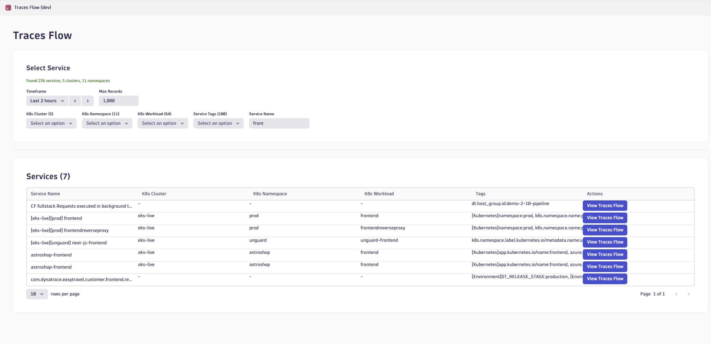
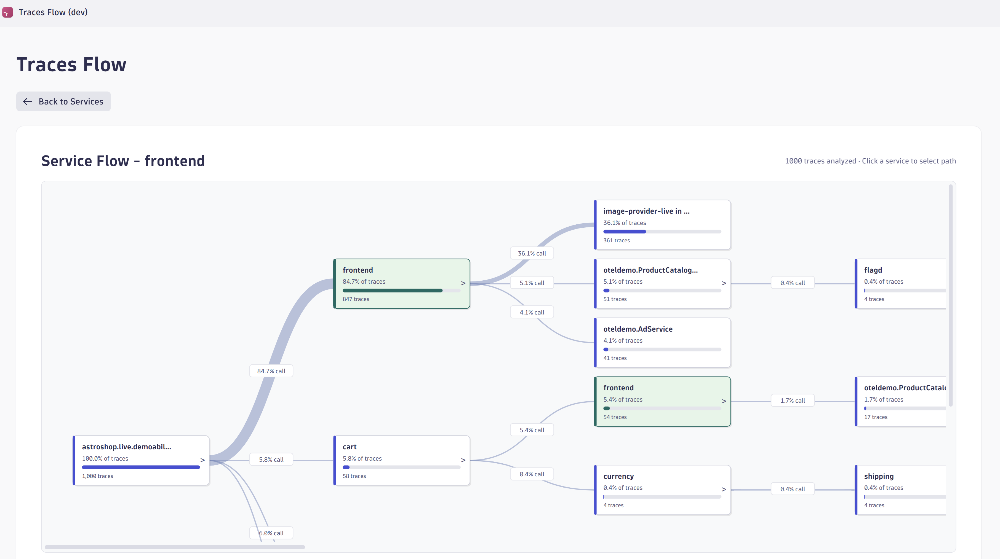
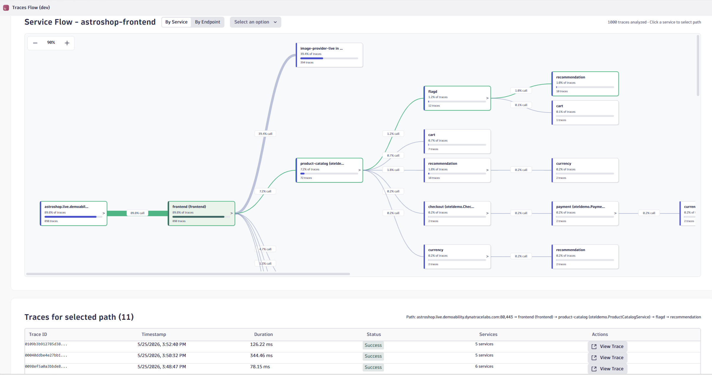
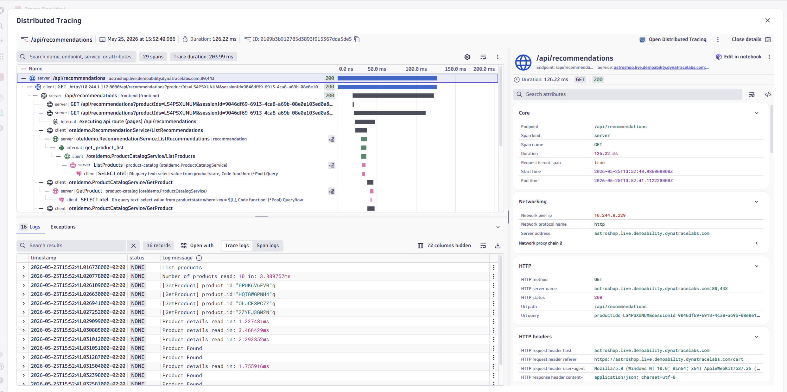

# Traces Flow

A Dynatrace App that visualizes trace flows through services using interactive Sankey-style diagrams.

## Features

- **Sankey Flow Diagram**: Visualize how traces flow through your services with an interactive tree diagram showing call percentages and trace counts
- **Service Filtering**: Filter services by:
  - Kubernetes cluster, namespace, and workload
  - Technology/SDK language (Node.js, Python, Go, Java, etc.)
  - Cloud provider (AWS, Azure, GCP)
  - Service tags
- **Timeframe Selection**: Analyze traces from the last 2 hours up to 72 hours
- **Scalable Analysis**: Process up to 1 million traces for comprehensive flow analysis
- **Theme Support**: Automatic light/dark mode adaptation
- **Trace Details**: Click on any path in the diagram to view individual traces
- **Distributed Tracing Integration**: Open any trace directly in Dynatrace Distributed Traces

## Screenshots

### Service Selection
Filter and browse services with advanced filtering options for Kubernetes, technology, cloud provider, and tags.

### Trace Flow Diagram
Interactive Sankey-style visualization showing how traces flow through services with call percentages.

### Trace List
View all traces for a selected path with timestamp, duration, status, and direct links to Distributed Tracing.

### Distributed Tracing Integration
Click on any trace to open it directly in Dynatrace Distributed Tracing for detailed span analysis.

## Required Permissions

The app requires the following scopes to be configured in your Dynatrace environment:

| Scope | Description |
|-------|-------------|
| `storage:spans:read` | Read distributed traces and span data |
| `storage:entities:read` | Read service entities and tags |
| `storage:logs:read` | Read log data |
| `storage:buckets:read` | Access storage buckets |
| `storage:metrics:read` | Read metrics data |

## Available Scripts in Dynatrace AppEngine

In the project directory, you can run:

### `npm run start`

Runs the app in the development mode. A new browser window with your running app will be automatically opened.

Edit a component file in `ui` and save it. The page will reload when you make changes. You may also see any errors in the console.

### `npm run build`

Builds the app for production to the `dist` folder. It correctly bundles your app in production mode and optimizes the build for the best performance.

### `npm run deploy`

Builds the app and deploys it to the specified environment in `app.config.json`.

### `npm run uninstall

Uninstalls the app from the specified environment in `app.config.json`.

### `npm run generate:function`

Generates a new serverless function for your app in the `api` folder.

### `npm run update`

Updates @dynatrace-scoped packages to the latest version and applies automatic migrations.

### `npm run info`

Outputs the CLI and environment information.

### `npm run help`

Outputs help for the Dynatrace App Toolkit.

## Learn more

You can find more information on how to use all the features of the new Dynatrace Platform in [Dynatrace Developer](https://dt-url.net/developers).

To learn React, check out the [React documentation](https://reactjs.org/).
